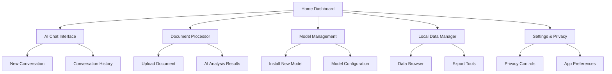

# Offline-First AI Application - Product Requirements Document

## 1. Product Overview
A privacy-focused, offline-first application that leverages lightweight AI models for local processing, ensuring complete data privacy and functionality without internet connectivity.

- **Problem Statement**: Users need AI-powered tools but are concerned about data privacy, internet dependency, and cloud service costs. Current AI applications require constant internet connectivity and send sensitive data to external servers.
- **Target Market**: Privacy-conscious users, professionals working in secure environments, users with limited internet connectivity, and anyone who wants AI capabilities without cloud dependencies.

## 2. Core Features

### 2.1 User Roles
Since this is an offline-first application, user roles are simplified and managed locally:

| Role | Access Method | Core Permissions |
|------|---------------|------------------|
| Local User | Direct app access | Full access to all features, local data management |
| Guest Mode | No setup required | Limited features, no data persistence |

### 2.2 Feature Module
Our offline-first AI application consists of the following main pages:

1. **Home Dashboard**: Main interface with AI model status, recent activities, and quick actions
2. **AI Chat Interface**: Local AI conversation with lightweight model processing
3. **Document Processor**: Upload and process documents locally with AI analysis
4. **Model Management**: Download, install, and manage lightweight AI models
5. **Local Data Manager**: Browse, organize, and export locally stored data
6. **Settings & Privacy**: Configure app preferences, model settings, and data management

### 2.3 Page Details

| Page Name | Module Name | Feature Description |
|-----------|-------------|---------------------|
| Home Dashboard | Model Status Panel | Display active AI model, performance metrics, offline status indicator |
| Home Dashboard | Quick Actions | Start new chat, upload document, access recent conversations |
| Home Dashboard | Activity Feed | Show recent AI interactions, processed documents, local data usage |
| AI Chat Interface | Conversation Area | Real-time chat with local AI model, message history, context awareness |
| AI Chat Interface | Input Controls | Text input, file upload, voice input (if supported), conversation settings |
| AI Chat Interface | Model Selector | Switch between installed AI models, model-specific settings |
| Document Processor | File Upload | Drag-and-drop interface for documents, support multiple formats (PDF, TXT, DOCX) |
| Document Processor | AI Analysis | Local processing for summarization, Q&A, content extraction |
| Document Processor | Results Viewer | Display processed results, export options, save to local storage |
| Model Management | Available Models | Browse lightweight models (Ollama, WebLLM, ONNX models) |
| Model Management | Installation | Download and install models locally, progress tracking |
| Model Management | Model Settings | Configure model parameters, memory usage, performance tuning |
| Local Data Manager | Data Browser | View all locally stored conversations, documents, processed data |
| Local Data Manager | Search & Filter | Find specific data, filter by date/type, full-text search |
| Local Data Manager | Export Tools | Export data to various formats, backup creation, data portability |
| Settings & Privacy | App Preferences | Theme, language, performance settings, storage management |
| Settings & Privacy | Privacy Controls | Data retention policies, local encryption, secure deletion |
| Settings & Privacy | Model Configuration | Default model selection, resource allocation, offline behavior |

## 3. Core Process

### Main User Flow (Offline-First)
1. **App Launch**: User opens PWA, checks for installed AI models and local data
2. **Model Setup**: First-time users download and install lightweight AI model
3. **Local Interaction**: User engages with AI chat, document processing, all locally
4. **Data Management**: User organizes, searches, and exports local data
5. **Model Management**: User updates or adds new AI models as needed
6. **Privacy Control**: User manages local data retention and security settings

### Page Navigation Flow

## 4. User Interface Design

### 4.1 Design Style (Offline-First Focus)
- **Primary Colors**: Deep green (#059669) for offline status, Clean white (#FFFFFF)
- **Secondary Colors**: Light gray (#F8FAFC), Charcoal (#374151), Amber (#F59E0B) for warnings
- **Status Indicators**: Green for offline-ready, Red for missing models, Blue for processing
- **Button Style**: Rounded corners (8px radius), clear offline/online states, tactile feedback
- **Typography**: System fonts for performance, 16px base size, clear hierarchy
- **Layout Style**: Dashboard-focused design, status-first approach, minimal resource usage
- **Icons**: Feather icons for lightweight performance, clear offline/online indicators

### 4.2 Page Design Overview

| Page Name | Module Name | UI Elements |
|-----------|-------------|-------------|
| Home Dashboard | Status Panel | Model status badges, offline indicator, resource usage meters |
| Home Dashboard | Quick Actions | Large touch-friendly buttons, recent activity cards, progress indicators |
| AI Chat Interface | Conversation | Message bubbles, typing indicators, model response time, local processing status |
| AI Chat Interface | Input Area | Text input with file drop zone, model selector dropdown, send button |
| Document Processor | Upload Zone | Drag-and-drop area, file type indicators, processing progress bars |
| Document Processor | Results | Collapsible sections, export buttons, local save confirmations |
| Model Management | Model Cards | Download progress, size indicators, performance ratings, install/remove buttons |
| Local Data Manager | Data Grid | Sortable columns, search bar, bulk actions, storage usage visualization |
| Settings & Privacy | Control Panels | Toggle switches, sliders for resource limits, clear data buttons |

### 4.3 Responsiveness & Offline Optimization
- **Approach**: Offline-first responsive design with minimal resource usage
- **Breakpoints**: Mobile (320px+), Tablet (768px+), Desktop (1024px+)
- **Offline Indicators**: Clear visual feedback for offline status throughout the app
- **Performance**: Aggressive caching, minimal animations, efficient rendering for battery life
- **Touch Optimization**: Large touch targets, swipe gestures, haptic feedback where available
- **Resource Management**: Visual indicators for memory/storage usage, performance warnings

## 5. Success Metrics

### Key Performance Indicators (KPIs) - Offline-First Focus
- **Privacy Metrics**: 100% local data processing, zero external data transmission
- **Performance Metrics**: Model inference time, local storage efficiency, battery usage
- **User Engagement**: Offline usage duration, model interaction frequency, document processing volume
- **Technical Metrics**: Model download success rate, local storage utilization, app responsiveness

### Success Criteria
- Achieve 100% offline functionality for all core features
- Maintain model inference response time under 5 seconds for typical queries
- Support local storage of 10GB+ data without performance degradation
- Achieve 90%+ user satisfaction with privacy and offline capabilities

## 6. Timeline and Milestones

### Phase 1: Offline Foundation (Weeks 1-4)
- Progressive Web App setup with offline capabilities
- Local storage implementation (IndexedDB/SQLite)
- Basic UI framework with offline-first design

### Phase 2: AI Model Integration (Weeks 5-8)
- Lightweight AI model integration (WebLLM/Ollama)
- Local inference engine implementation
- Model management system (download/install/configure)

### Phase 3: Core Features (Weeks 9-12)
- AI chat interface with local processing
- Document processor with local AI analysis
- Local data management and search capabilities

### Phase 4: Optimization & Polish (Weeks 13-16)
- Performance optimization for various devices
- Advanced privacy controls and data management
- Comprehensive offline testing and bug fixes

## 7. Technical Requirements

### Offline Performance Requirements
- Full functionality without internet connection
- Model inference time: <5 seconds for standard queries
- Local storage: Support 10GB+ data with efficient indexing
- Battery optimization: Minimal background processing

### Privacy & Security Requirements
- 100% local data processing - no external data transmission
- Local encryption for sensitive data
- Secure model storage and execution
- User-controlled data retention and deletion

### Device Support
- Modern browsers with WebAssembly support
- Progressive Web App installation capability
- Minimum 4GB RAM for optimal AI model performance
- Support for File System Access API where available

## 8. Risk Assessment

### Technical Risks
- **Model Performance**: Lightweight models may have limited capabilities compared to cloud alternatives
- **Device Limitations**: Older devices may struggle with local AI processing
- **Storage Constraints**: Large models and data may exceed device storage limits
- **Browser Compatibility**: Advanced features may not work on all browsers

### Mitigation Strategies
- **Model Optimization**: Provide multiple model sizes for different device capabilities
- **Progressive Enhancement**: Graceful degradation for less capable devices
- **Storage Management**: Intelligent data cleanup and compression strategies
- **Fallback Options**: Basic functionality for unsupported browsers

## 9. Privacy & Offline Benefits

### Privacy Advantages
- **Complete Data Control**: All data remains on user's device
- **No Tracking**: No external analytics or data collection
- **Secure Processing**: AI inference happens locally without data transmission
- **User Ownership**: Users own and control all their data and conversations

### Offline Benefits
- **Always Available**: Works without internet connectivity
- **No Subscription**: No ongoing cloud service costs
- **Fast Response**: No network latency for AI interactions
- **Reliable**: Not dependent on external service availability

## 10. Appendix

### Glossary
- **Lightweight AI Model**: Optimized AI models designed for local device execution
- **Local Inference**: AI processing that occurs entirely on the user's device
- **Progressive Web App (PWA)**: Web application that works offline and can be installed
- **IndexedDB**: Browser-based database for local data storage

### References
- [WebLLM Documentation](https://webllm.mlc.ai/)
- [Ollama Local Models](https://ollama.ai/)
- [Progressive Web App Guidelines](https://web.dev/progressive-web-apps/)
- [File System Access API](https://developer.mozilla.org/en-US/docs/Web/API/File_System_Access_API)