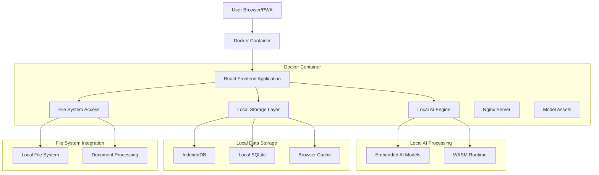
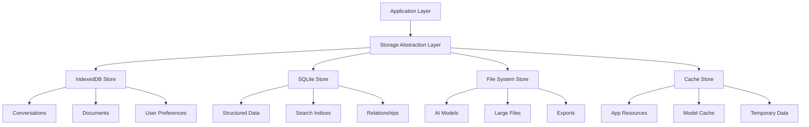

# Offline-First AI Application - Technical Architecture Document

## 1. Architecture Design



## 2. Technology Description

### Core Technologies
- **Frontend**: React@18 + TypeScript + Vite + Tailwind CSS
- **AI Processing**: TensorFlow.js + ONNX.js with embedded models
- **Local Storage**: IndexedDB + SQLite (sql.js) + File System Access API
- **PWA**: Service Workers + Web App Manifest
- **Build System**: Vite with custom model bundling plugins

### Embedded AI Models (Bundled with App)
- **Primary Model**: TinyLlama-1.1B (ONNX format, ~2.2GB quantized to INT8)
- **Alternative**: Phi-3-mini-4k (ONNX format, ~2.4GB quantized)
- **Fallback**: DistilBERT-base (ONNX format, ~250MB for basic NLP tasks)
- **Model Format**: ONNX.js compatible, optimized for WebAssembly execution
- **Bundle Strategy**: Models included in application assets during build process

**WebLLM Models**:
- Llama-2-7B-Chat (Quantized for web)
- Phi-2 (Microsoft's lightweight model)
- TinyLlama-1.1B (Ultra-lightweight option)

**Ollama.js Integration**:
- Local Ollama server communication
- Model pulling and management
- Custom model support

**ONNX Runtime Models**:
- Quantized transformer models
- Custom fine-tuned models
- Specialized task models (summarization, Q&A)

### 4.2 AI Processing Pipeline

```typescript
interface AIProcessingPipeline {
  modelLoader: ModelLoader;
  tokenizer: Tokenizer;
  inferenceEngine: InferenceEngine;
  responseProcessor: ResponseProcessor;
}

interface ModelConfig {
  modelName: string;
  modelSize: number;
  quantization: 'int4' | 'int8' | 'fp16';
  maxTokens: number;
  temperature: number;
}
```

### 4.3 Local Inference API

**Chat Completion**:
```typescript
POST /api/local/chat/completions
```

Request:
| Param Name | Param Type | Required | Description |
|------------|------------|----------|-------------|
| messages | Message[] | true | Conversation history |
| model | string | true | Local model identifier |
| temperature | number | false | Response randomness (0-1) |
| max_tokens | number | false | Maximum response length |

Response:
| Param Name | Param Type | Description |
|------------|------------|-------------|
| choices | Choice[] | Generated responses |
| usage | Usage | Token usage statistics |
| processing_time | number | Local inference time |

**Document Analysis**:
```typescript
POST /api/local/documents/analyze
```

Request:
| Param Name | Param Type | Required | Description |
|------------|------------|----------|-------------|
| document | File | true | Document to analyze |
| task | string | true | Analysis type (summarize, qa, extract) |
| model | string | true | Local model to use |

Response:
| Param Name | Param Type | Description |
|------------|------------|-------------|
| analysis | string | Generated analysis |
| confidence | number | Analysis confidence score |
| processing_time | number | Local processing duration |

## 5. Local Storage Architecture

### 5.1 Storage Layer Design



### 5.2 Data Models

**Conversation Storage**:
```sql
CREATE TABLE conversations (
    id TEXT PRIMARY KEY,
    title TEXT NOT NULL,
    model_used TEXT NOT NULL,
    created_at INTEGER NOT NULL,
    updated_at INTEGER NOT NULL,
    message_count INTEGER DEFAULT 0,
    total_tokens INTEGER DEFAULT 0
);

CREATE TABLE messages (
    id TEXT PRIMARY KEY,
    conversation_id TEXT NOT NULL,
    role TEXT CHECK(role IN ('user', 'assistant', 'system')),
    content TEXT NOT NULL,
    timestamp INTEGER NOT NULL,
    tokens INTEGER DEFAULT 0,
    processing_time INTEGER DEFAULT 0,
    FOREIGN KEY (conversation_id) REFERENCES conversations(id)
);
```

**Document Storage**:
```sql
CREATE TABLE documents (
    id TEXT PRIMARY KEY,
    filename TEXT NOT NULL,
    file_type TEXT NOT NULL,
    file_size INTEGER NOT NULL,
    content_hash TEXT NOT NULL,
    uploaded_at INTEGER NOT NULL,
    processed_at INTEGER,
    analysis_results TEXT
);

CREATE TABLE document_analyses (
    id TEXT PRIMARY KEY,
    document_id TEXT NOT NULL,
    analysis_type TEXT NOT NULL,
    model_used TEXT NOT NULL,
    results TEXT NOT NULL,
    confidence_score REAL,
    created_at INTEGER NOT NULL,
    FOREIGN KEY (document_id) REFERENCES documents(id)
);
```

**Model Management**:
```sql
CREATE TABLE installed_models (
    id TEXT PRIMARY KEY,
    name TEXT NOT NULL,
    version TEXT NOT NULL,
    size_bytes INTEGER NOT NULL,
    model_type TEXT NOT NULL,
    quantization TEXT,
    installed_at INTEGER NOT NULL,
    last_used INTEGER,
    usage_count INTEGER DEFAULT 0,
    performance_rating REAL
);
```

## 6. Progressive Web App Configuration

### 6.1 Service Worker Strategy

```typescript
// Service Worker for offline functionality
const CACHE_NAME = 'offline-ai-app-v1';
const STATIC_RESOURCES = [
  '/',
  '/static/js/bundle.js',
  '/static/css/main.css',
  '/models/manifest.json'
];

// Cache-first strategy for app shell
// Network-first for dynamic content
// Cache-only for AI models
```

### 6.2 PWA Manifest

```json
{
  "name": "Offline AI Assistant",
  "short_name": "AI Assistant",
  "description": "Privacy-focused offline AI application",
  "start_url": "/",
  "display": "standalone",
  "background_color": "#ffffff",
  "theme_color": "#059669",
  "categories": ["productivity", "utilities", "ai"],
  "screenshots": [
    {
      "src": "/screenshots/desktop.png",
      "sizes": "1280x720",
      "type": "image/png",
      "form_factor": "wide"
    }
  ]
}
```

## 7. Performance Optimization

### 7.1 Model Loading Strategy

- **Lazy Loading**: Load models only when needed
- **Progressive Loading**: Stream large models in chunks
- **Model Caching**: Persistent storage for downloaded models
- **Memory Management**: Unload unused models to free RAM

### 7.2 Inference Optimization

- **WebAssembly**: Use WASM for CPU-intensive operations
- **Web Workers**: Offload inference to background threads
- **Quantization**: Use INT4/INT8 quantized models for speed
- **Batching**: Process multiple requests efficiently

### 7.3 Storage Optimization

- **Compression**: Compress stored conversations and documents
- **Indexing**: Efficient search indices for large datasets
- **Cleanup**: Automatic cleanup of old data based on user preferences
- **Deduplication**: Avoid storing duplicate content

## 8. Privacy & Security

### 8.1 Data Privacy

- **Local Processing**: All AI inference happens on device
- **No Telemetry**: Zero data collection or external communication
- **User Control**: Complete user control over data retention
- **Secure Deletion**: Cryptographically secure data deletion

### 8.2 Security Measures

- **Content Security Policy**: Strict CSP to prevent XSS
- **Local Encryption**: Encrypt sensitive data at rest
- **Secure Origins**: HTTPS-only for security features
- **Sandboxing**: Isolate AI model execution

## 9. Device Requirements & Compatibility

### 9.1 Minimum Requirements

- **RAM**: 4GB minimum, 8GB recommended
- **Storage**: 2GB free space for models and data
- **Browser**: Chrome 90+, Firefox 88+, Safari 14+, Edge 90+
- **WebAssembly**: WASM support required
- **IndexedDB**: For local data storage

### 9.2 Feature Detection

```typescript
interface DeviceCapabilities {
  hasWebAssembly: boolean;
  hasIndexedDB: boolean;
  hasFileSystemAccess: boolean;
  hasWebWorkers: boolean;
  availableMemory: number;
  storageQuota: number;
}
```

## 10. Deployment Strategy

### 10.1 Static Hosting

- **Vercel/Netlify**: Static site deployment
- **CDN Distribution**: Global content delivery
- **HTTPS**: Secure origins for PWA features
- **Caching**: Aggressive caching for app resources

### 10.2 Model Distribution

- **Model Registry**: Centralized model catalog
- **CDN Delivery**: Fast model downloads
- **Integrity Checks**: Verify model authenticity
- **Version Management**: Handle model updates

### 10.3 Offline-First Deployment

```typescript
// Build configuration for offline-first deployment
export default {
  build: {
    rollupOptions: {
      output: {
        manualChunks: {
          'ai-models': ['@webllm/web-llm'],
          'storage': ['sql.js', 'idb'],
          'ui': ['react', 'react-dom']
        }
      }
    }
  },
  plugins: [
    VitePWA({
      strategies: 'injectManifest',
      injectManifest: {
        swSrc: 'src/sw.ts'
      }
    })
  ]
};
```

This architecture ensures complete offline functionality while maintaining high performance and user privacy through local AI processing and storage.

## 11. Docker Containerization Strategy

### 11.1 Multi-Stage Docker Build

```dockerfile
# Build stage
FROM node:18-alpine AS builder

WORKDIR /app

# Copy package files
COPY package*.json ./
COPY tsconfig.json ./
COPY vite.config.ts ./

# Install dependencies
RUN npm ci --only=production

# Copy source code
COPY src/ ./src/
COPY public/ ./public/

# Copy AI models to build context
COPY models/ ./public/models/

# Build the application with embedded models
RUN npm run build

# Production stage
FROM nginx:alpine AS production

# Install security updates
RUN apk update && apk upgrade && apk add --no-cache \
    curl \
    && rm -rf /var/cache/apk/*

# Copy built application
COPY --from=builder /app/dist /usr/share/nginx/html

# Copy custom nginx configuration
COPY docker/nginx.conf /etc/nginx/nginx.conf
COPY docker/default.conf /etc/nginx/conf.d/default.conf

# Copy AI models to nginx static directory
COPY --from=builder /app/public/models /usr/share/nginx/html/models

# Create non-root user for security
RUN addgroup -g 1001 -S nodejs && \
    adduser -S nextjs -u 1001 -G nodejs

# Set ownership and permissions
RUN chown -R nextjs:nodejs /usr/share/nginx/html && \
    chown -R nextjs:nodejs /var/cache/nginx && \
    chown -R nextjs:nodejs /var/log/nginx && \
    chown -R nextjs:nodejs /etc/nginx/conf.d

# Switch to non-root user
USER nextjs

# Health check
HEALTHCHECK --interval=30s --timeout=3s --start-period=5s --retries=3 \
    CMD curl -f http://localhost:80/health || exit 1

# Expose port
EXPOSE 80

# Start nginx
CMD ["nginx", "-g", "daemon off;"]
```

### 11.2 Docker Compose Configuration

#### Development Environment
```yaml
# docker-compose.dev.yml
version: '3.8'

services:
  offline-ai-app:
    build:
      context: .
      dockerfile: Dockerfile.dev
      target: development
    ports:
      - "3000:3000"
      - "5173:5173"  # Vite dev server
    volumes:
      - .:/app
      - /app/node_modules
      - ./models:/app/public/models:ro
      - user-data:/app/data
    environment:
      - NODE_ENV=development
      - VITE_MODEL_PATH=/models
      - VITE_STORAGE_QUOTA=5GB
    restart: unless-stopped
    healthcheck:
      test: ["CMD", "curl", "-f", "http://localhost:3000/health"]
      interval: 30s
      timeout: 10s
      retries: 3

volumes:
  user-data:
    driver: local
```

#### Production Environment
```yaml
# docker-compose.prod.yml
version: '3.8'

services:
  offline-ai-app:
    build:
      context: .
      dockerfile: Dockerfile
      target: production
    ports:
      - "80:80"
      - "443:443"
    volumes:
      - user-data:/data
      - ./ssl:/etc/nginx/ssl:ro
    environment:
      - NODE_ENV=production
      - NGINX_HOST=localhost
      - NGINX_PORT=80
    restart: always
    security_opt:
      - no-new-privileges:true
    cap_drop:
      - ALL
    cap_add:
      - CHOWN
      - SETGID
      - SETUID
    healthcheck:
      test: ["CMD", "curl", "-f", "http://localhost:80/health"]
      interval: 30s
      timeout: 10s
      retries: 3
      start_period: 40s

volumes:
  user-data:
    driver: local
    driver_opts:
      type: none
      o: bind
      device: ./data
```

### 11.3 Model Bundling Strategy

#### Model Download Script
```bash
#!/bin/bash
# scripts/download-models.sh

set -e

MODELS_DIR="./models"
mkdir -p $MODELS_DIR

echo "Downloading AI models for offline use..."

# TinyLlama-1.1B (ONNX format)
if [ ! -f "$MODELS_DIR/tinyllama-1.1b.onnx" ]; then
    echo "Downloading TinyLlama-1.1B..."
    curl -L "https://huggingface.co/microsoft/TinyLlama-1.1B-Chat-v1.0-onnx/resolve/main/model.onnx" \
         -o "$MODELS_DIR/tinyllama-1.1b.onnx"
fi

# Phi-3-mini (ONNX format)
if [ ! -f "$MODELS_DIR/phi-3-mini.onnx" ]; then
    echo "Downloading Phi-3-mini..."
    curl -L "https://huggingface.co/microsoft/Phi-3-mini-4k-instruct-onnx/resolve/main/cpu_and_mobile/cpu-int4-rtn-block-32/model.onnx" \
         -o "$MODELS_DIR/phi-3-mini.onnx"
fi

# DistilBERT (ONNX format)
if [ ! -f "$MODELS_DIR/distilbert-base.onnx" ]; then
    echo "Downloading DistilBERT..."
    curl -L "https://huggingface.co/distilbert-base-uncased/resolve/main/onnx/model.onnx" \
         -o "$MODELS_DIR/distilbert-base.onnx"
fi

echo "Model download completed!"
```

#### Build Hook Integration
```json
{
  "scripts": {
    "prebuild": "chmod +x scripts/download-models.sh && ./scripts/download-models.sh",
    "build": "vite build",
    "docker:build": "docker build -t offline-ai-app .",
    "docker:dev": "docker-compose -f docker-compose.dev.yml up --build",
    "docker:prod": "docker-compose -f docker-compose.prod.yml up -d --build"
  }
}
```

### 11.4 Nginx Configuration

#### Main Nginx Config
```nginx
# docker/nginx.conf
user nextjs;
worker_processes auto;
error_log /var/log/nginx/error.log warn;
pid /var/run/nginx.pid;

events {
    worker_connections 1024;
    use epoll;
    multi_accept on;
}

http {
    include /etc/nginx/mime.types;
    default_type application/octet-stream;

    # Logging
    log_format main '$remote_addr - $remote_user [$time_local] "$request" '
                    '$status $body_bytes_sent "$http_referer" '
                    '"$http_user_agent" "$http_x_forwarded_for"';
    access_log /var/log/nginx/access.log main;

    # Performance
    sendfile on;
    tcp_nopush on;
    tcp_nodelay on;
    keepalive_timeout 65;
    types_hash_max_size 2048;

    # Gzip compression
    gzip on;
    gzip_vary on;
    gzip_min_length 1024;
    gzip_types text/plain text/css text/xml text/javascript 
               application/javascript application/xml+rss 
               application/json application/wasm;

    # Security headers
    add_header X-Frame-Options DENY always;
    add_header X-Content-Type-Options nosniff always;
    add_header X-XSS-Protection "1; mode=block" always;
    add_header Referrer-Policy "strict-origin-when-cross-origin" always;

    # Include server configurations
    include /etc/nginx/conf.d/*.conf;
}
```

#### Server Configuration
```nginx
# docker/default.conf
server {
    listen 80;
    server_name localhost;
    root /usr/share/nginx/html;
    index index.html;

    # Security
    server_tokens off;
    
    # PWA and offline support
    location / {
        try_files $uri $uri/ /index.html;
        
        # Cache static assets
        location ~* \.(js|css|png|jpg|jpeg|gif|ico|svg|woff|woff2|ttf|eot)$ {
            expires 1y;
            add_header Cache-Control "public, immutable";
        }
        
        # Cache AI models aggressively
        location /models/ {
            expires 1y;
            add_header Cache-Control "public, immutable";
            add_header Access-Control-Allow-Origin "*";
        }
    }

    # Service Worker
    location /sw.js {
        add_header Cache-Control "no-cache, no-store, must-revalidate";
        add_header Pragma "no-cache";
        add_header Expires "0";
    }

    # Web App Manifest
    location /manifest.json {
        add_header Cache-Control "no-cache, no-store, must-revalidate";
        add_header Content-Type "application/manifest+json";
    }

    # Health check endpoint
    location /health {
        access_log off;
        return 200 "healthy\n";
        add_header Content-Type text/plain;
    }

    # API routes (local processing)
    location /api/ {
        add_header Cache-Control "no-cache, no-store, must-revalidate";
        try_files $uri $uri/ /index.html;
    }

    # Error pages
    error_page 404 /index.html;
    error_page 500 502 503 504 /50x.html;
    location = /50x.html {
        root /usr/share/nginx/html;
    }
}
```

### 11.5 Development Dockerfile

```dockerfile
# Dockerfile.dev
FROM node:18-alpine AS development

WORKDIR /app

# Install development dependencies
RUN apk add --no-cache \
    curl \
    git \
    python3 \
    make \
    g++

# Copy package files
COPY package*.json ./
RUN npm install

# Copy source code
COPY . .

# Create models directory
RUN mkdir -p public/models

# Expose development ports
EXPOSE 3000 5173

# Health check for development
HEALTHCHECK --interval=30s --timeout=3s --start-period=5s --retries=3 \
    CMD curl -f http://localhost:3000 || exit 1

# Start development server
CMD ["npm", "run", "dev", "--", "--host", "0.0.0.0"]
```

### 11.6 Container Security Configuration

#### Security Best Practices
```yaml
# docker-compose.security.yml
version: '3.8'

services:
  offline-ai-app:
    build:
      context: .
      dockerfile: Dockerfile
    security_opt:
      - no-new-privileges:true
      - apparmor:docker-default
    cap_drop:
      - ALL
    cap_add:
      - CHOWN
      - SETGID
      - SETUID
      - DAC_OVERRIDE
    read_only: true
    tmpfs:
      - /tmp:noexec,nosuid,size=100m
      - /var/cache/nginx:noexec,nosuid,size=50m
      - /var/log/nginx:noexec,nosuid,size=50m
    ulimits:
      nproc: 65535
      nofile:
        soft: 65535
        hard: 65535
```

### 11.7 Environment Configuration

#### Environment Variables
```bash
# .env.production
NODE_ENV=production
VITE_APP_NAME="Offline AI Assistant"
VITE_MODEL_PATH="/models"
VITE_STORAGE_QUOTA="5GB"
VITE_MAX_CONVERSATIONS=1000
VITE_MAX_DOCUMENT_SIZE="100MB"
VITE_ENABLE_ANALYTICS=false
VITE_PRIVACY_MODE=true

# Container specific
NGINX_HOST=localhost
NGINX_PORT=80
NGINX_WORKER_PROCESSES=auto
NGINX_WORKER_CONNECTIONS=1024
```

### 11.8 Deployment Scripts

#### Production Deployment
```bash
#!/bin/bash
# scripts/deploy.sh

set -e

echo "Starting deployment of Offline AI Application..."

# Build and tag the image
docker build -t offline-ai-app:latest .
docker tag offline-ai-app:latest offline-ai-app:$(date +%Y%m%d-%H%M%S)

# Stop existing container
docker-compose -f docker-compose.prod.yml down

# Start new container
docker-compose -f docker-compose.prod.yml up -d

# Wait for health check
echo "Waiting for application to be healthy..."
timeout 60 bash -c 'until curl -f http://localhost/health; do sleep 2; done'

echo "Deployment completed successfully!"
```

#### Backup Script
```bash
#!/bin/bash
# scripts/backup.sh

BACKUP_DIR="./backups/$(date +%Y%m%d-%H%M%S)"
mkdir -p $BACKUP_DIR

# Backup user data volume
docker run --rm -v offline-ai-app_user-data:/data -v $(pwd)/$BACKUP_DIR:/backup \
    alpine tar czf /backup/user-data.tar.gz -C /data .

# Backup container image
docker save offline-ai-app:latest | gzip > $BACKUP_DIR/offline-ai-app.tar.gz

echo "Backup completed: $BACKUP_DIR"
```

### 11.9 Monitoring and Logging

#### Docker Compose with Monitoring
```yaml
# docker-compose.monitoring.yml
version: '3.8'

services:
  offline-ai-app:
    # ... existing configuration
    logging:
      driver: "json-file"
      options:
        max-size: "10m"
        max-file: "3"
    labels:
      - "traefik.enable=true"
      - "traefik.http.routers.ai-app.rule=Host(`localhost`)"

  # Optional: Add monitoring if needed
  watchtower:
    image: containrrr/watchtower
    volumes:
      - /var/run/docker.sock:/var/run/docker.sock
    command: --interval 30 --cleanup
    restart: unless-stopped
```

This Docker configuration provides:

1. **Multi-stage builds** for optimized production images
2. **Security hardening** with non-root users and restricted capabilities  
3. **Model bundling** directly into the container image
4. **Development and production** environments
5. **Health checks** and monitoring
6. **Persistent storage** for user data
7. **Nginx optimization** for PWA and offline capabilities
8. **Easy deployment** with scripts and compose files

The containerized application maintains all offline-first capabilities while being easily deployable across different environments!